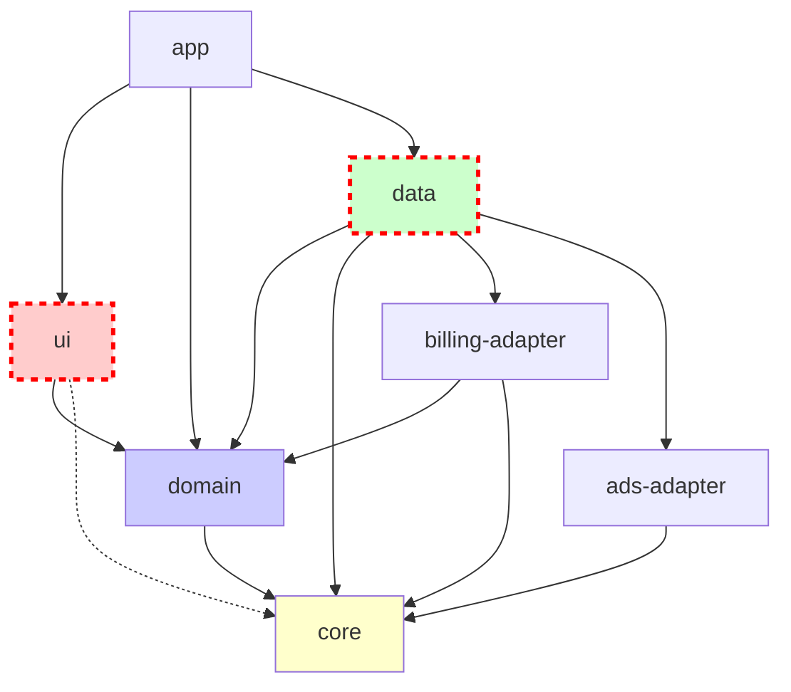

# MementoMed Architecture Design

## 1. Summary

Clean architecture with module boundaries enforced by Gradle `api`/`implementation` and ArchUnit tests. Domain interfaces exposed via `api`, implementations hidden via `implementation`. Hilt for DI.

## 2. Module List & Responsibilities

```
:app              - Application entry point, navigation, feature composition
:ui               - Compose UI components, design system, navigation shell
:domain           - Business interfaces (BillingService, EntitlementService, TrialService)
:data             - Room repositories, Billing adapter, AdMob adapter, implementations
:core             - Result/Either types, Logger, Telemetry interfaces, pure Kotlin utilities
:billing-adapter  - Google Play BillingClient wrapper (optional, can be in :data)
:ads-adapter      - AdMob wrapper (optional, can be in :data)
```

## 3. Mermaid Dependency Graph



## 4. Allowed Dependency Matrix

| From → To | app | ui | domain | data | core | billing-adapter | ads-adapter |
|-----------|-----|----|--------|------|------|-----------------|-------------|
| app | - | ✅ | ✅ | ✅ | ❌ | ❌ | ❌ |
| ui | ❌ | - | ✅ | ❌ | ✅* | ❌ | ❌ |
| domain | ❌ | ❌ | - | ❌ | ✅ | ❌ | ❌ |
| data | ❌ | ❌ | ✅ | - | ✅ | ✅ | ✅ |
| core | ❌ | ❌ | ❌ | ❌ | - | ❌ | ❌ |
| billing-adapter | ❌ | ❌ | ✅ | ❌ | ✅ | - | ❌ |
| ads-adapter | ❌ | ❌ | ❌ | ❌ | ✅ | ❌ | - |

*ui → core: only for Result/Either types, Logger interface (not implementations)

## 5. Gradle Configuration

### settings.gradle.kts
```kotlin
rootProject.name = "MementoMed"

include(
    ":app",
    ":ui",
    ":domain",
    ":data",
    ":core",
    ":billing-adapter",
    ":ads-adapter"
)
```

### :core/build.gradle.kts
```kotlin
plugins {
    id("com.android.library")
    kotlin("android")
}

android {
    namespace = "com.mementomed.core"
    compileSdk = 34
    defaultConfig { minSdk = 24 }
    kotlinOptions { jvmTarget = "17" }
}

dependencies {
    // Pure Kotlin, no Android dependencies
    implementation("org.jetbrains.kotlinx:kotlinx-coroutines-core:1.7.3")
}
```

### :domain/build.gradle.kts
```kotlin
plugins {
    id("com.android.library")
    kotlin("android")
}

android {
    namespace = "com.mementomed.domain"
    compileSdk = 34
    defaultConfig { minSdk = 24 }
    kotlinOptions { jvmTarget = "17" }
}

dependencies {
    // Expose core types via api
    api(project(":core"))
}
```

### :data/build.gradle.kts
```kotlin
plugins {
    id("com.android.library")
    kotlin("android")
    kotlin("kapt")
    id("dagger.hilt.android.plugin")
}

android {
    namespace = "com.mementomed.data"
    compileSdk = 34
    defaultConfig { minSdk = 24 }
    kotlinOptions { jvmTarget = "17" }
}

dependencies {
    // Use implementation to hide internals
    implementation(project(":domain"))
    implementation(project(":core"))
    implementation(project(":billing-adapter"))
    implementation(project(":ads-adapter"))
    
    // Room, Hilt, etc.
    implementation("androidx.room:room-runtime:2.6.1")
    implementation("androidx.room:room-ktx:2.6.1")
    kapt("androidx.room:room-compiler:2.6.1")
    implementation("com.google.dagger:hilt-android:2.47")
    kapt("com.google.dagger:hilt-compiler:2.47")
}
```

### :ui/build.gradle.kts
```kotlin
plugins {
    id("com.android.library")
    kotlin("android")
    id("org.jetbrains.kotlin.plugin.compose")
}

android {
    namespace = "com.mementomed.ui"
    compileSdk = 34
    defaultConfig { minSdk = 24 }
    buildFeatures { compose = true }
    composeOptions { kotlinCompilerExtensionVersion = "1.5.4" }
    kotlinOptions { jvmTarget = "17" }
}

dependencies {
    // Only domain interfaces, not data implementations
    implementation(project(":domain"))
    // Core types only (Result, Logger interface)
    implementation(project(":core"))
    
    implementation(platform("androidx.compose:compose-bom:2024.10.00"))
    implementation("androidx.compose.ui:ui")
    implementation("androidx.compose.material3:material3")
}
```

### :app/build.gradle.kts
```kotlin
plugins {
    id("com.android.application")
    kotlin("android")
    id("dagger.hilt.android.plugin")
    kotlin("kapt")
}

android {
    namespace = "com.mementomed.app"
    compileSdk = 34
    // ... app config
}

dependencies {
    implementation(project(":ui"))
    implementation(project(":domain"))
    implementation(project(":data"))
    
    implementation("com.google.dagger:hilt-android:2.47")
    kapt("com.google.dagger:hilt-compiler:2.47")
}
```

## 6. Hilt DI Binding Example

### :domain/src/main/kotlin/com/mementomed/domain/billing/BillingService.kt
```kotlin
package com.mementomed.domain.billing

import com.mementomed.core.Result

interface BillingService {
    suspend fun purchaseSubscription(productId: String): Result<Unit>
    suspend fun getEntitlements(): Result<List<Entitlement>>
    suspend fun isSubscribed(): Boolean
}

data class Entitlement(
    val productId: String,
    val isActive: Boolean,
    val expiresAt: Long?
)
```

### :data/src/main/kotlin/com/mementomed/data/billing/BillingServiceImpl.kt
```kotlin
package com.mementomed.data.billing

import com.mementomed.domain.billing.BillingService
import com.mementomed.domain.billing.Entitlement
import com.mementomed.core.Result
import javax.inject.Inject

internal class BillingServiceImpl @Inject constructor(
    private val billingAdapter: BillingAdapter
) : BillingService {
    override suspend fun purchaseSubscription(productId: String): Result<Unit> {
        // Implementation
    }
    
    override suspend fun getEntitlements(): Result<List<Entitlement>> {
        // Implementation
    }
    
    override suspend fun isSubscribed(): Boolean {
        // Implementation
    }
}
```

### :data/src/main/kotlin/com/mementomed/data/di/DataModule.kt
```kotlin
package com.mementomed.data.di

import com.mementomed.domain.billing.BillingService
import com.mementomed.data.billing.BillingServiceImpl
import dagger.Binds
import dagger.Module
import dagger.hilt.InstallIn
import dagger.hilt.components.SingletonComponent
import javax.inject.Singleton

@Module
@InstallIn(SingletonComponent::class)
abstract class DataModule {
    @Binds
    @Singleton
    abstract fun bindBillingService(
        impl: BillingServiceImpl
    ): BillingService
}
```

## 7. ArchUnit Rules

### :app/src/test/kotlin/com/mementomed/arch/ArchitectureTests.kt
```kotlin
package com.mementomed.arch

import com.tngtech.archunit.core.domain.JavaClasses
import com.tngtech.archunit.core.importer.ClassFileImporter
import com.tngtech.archunit.lang.syntax.ArchRuleDefinition.*
import org.junit.jupiter.api.Test

class ArchitectureTests {
    private val classes: JavaClasses = ClassFileImporter()
        .importPackages("com.mementomed")

    @Test
    fun `domain should not depend on ui`() {
        noClasses()
            .that().resideInAPackage("..domain..")
            .should().dependOnClassesThat().resideInAPackage("..ui..")
            .check(classes)
    }

    @Test
    fun `ui should not depend on data`() {
        noClasses()
            .that().resideInAPackage("..ui..")
            .should().dependOnClassesThat().resideInAPackage("..data..")
            .check(classes)
    }

    @Test
    fun `core should not depend on any other module`() {
        noClasses()
            .that().resideInAPackage("..core..")
            .should().dependOnClassesThat()
            .resideInAnyPackage("..domain..", "..data..", "..ui..", "..app..")
            .check(classes)
    }

    @Test
    fun `domain should not depend on data`() {
        noClasses()
            .that().resideInAPackage("..domain..")
            .should().dependOnClassesThat().resideInAPackage("..data..")
            .check(classes)
    }

    @Test
    fun `no cycles between modules`() {
        val rule = slices()
            .matching("com.mementomed.(*)..")
            .should().beFreeOfCycles()
        rule.check(classes)
    }
}
```

### :app/build.gradle.kts (test dependencies)
```kotlin
dependencies {
    testImplementation("com.tngtech.archunit:archunit:1.2.1")
    testImplementation("org.junit.jupiter:junit-jupiter:5.10.0")
}
```

## 8. Gradle Task for Architecture Tests

### Root build.gradle.kts
```kotlin
tasks.register("checkArchitecture") {
    group = "verification"
    description = "Runs architecture tests to enforce module boundaries"
    dependsOn(":app:testDebugUnitTest")
    doLast {
        println("Architecture checks passed")
    }
}

tasks.named("check") {
    dependsOn("checkArchitecture")
}
```

### Custom cycle detection script: gradle/checkDependencies.gradle.kts
```kotlin
import org.gradle.api.Project
import org.gradle.api.tasks.TaskContainer

fun Project.checkDependencyCycles() {
    val moduleGraph = mapOf(
        "app" to setOf("ui", "domain", "data"),
        "ui" to setOf("domain", "core"),
        "domain" to setOf("core"),
        "data" to setOf("domain", "core", "billing-adapter", "ads-adapter"),
        "core" to emptySet(),
        "billing-adapter" to setOf("domain", "core"),
        "ads-adapter" to setOf("core")
    )
    
    val forbidden = mapOf(
        "ui" to setOf("data", "app"),
        "domain" to setOf("ui", "data", "app"),
        "core" to setOf("ui", "domain", "data", "app", "billing-adapter", "ads-adapter")
    )
    
    fun hasCycle(node: String, visited: Set<String>, recStack: Set<String>): Boolean {
        if (recStack.contains(node)) return true
        if (visited.contains(node)) return false
        visited + node
        recStack + node
        moduleGraph[node]?.forEach { dep ->
            if (hasCycle(dep, visited, recStack + node)) return true
        }
        return false
    }
    
    moduleGraph.keys.forEach { module ->
        if (hasCycle(module, emptySet(), emptySet())) {
            throw GradleException("Cycle detected involving module: $module")
        }
        forbidden[module]?.forEach { forbiddenDep ->
            if (moduleGraph[module]?.contains(forbiddenDep) == true) {
                throw GradleException("Forbidden dependency: $module -> $forbiddenDep")
            }
        }
    }
}

tasks.register("checkDependencyCycles") {
    doLast {
        checkDependencyCycles()
    }
}
```

## 9. Acceptance Checklist

| Test Name | Assertion | Location |
|-----------|-----------|----------|
| `ArchitectureTests.domainNoUiDependency` | Domain classes do not reference UI classes | `:app/src/test/.../ArchitectureTests.kt` |
| `ArchitectureTests.uiNoDataDependency` | UI classes do not reference data classes | Same file |
| `ArchitectureTests.coreNoOtherModules` | Core does not depend on domain/data/ui/app | Same file |
| `ArchitectureTests.noCycles` | No circular dependencies between modules | Same file |
| `checkDependencyCycles` (Gradle task) | Forbidden edges and cycles detected | Root `build.gradle.kts` |
| `checkArchitecture` (Gradle task) | Runs all arch tests in CI | Root `build.gradle.kts` |

## 10. Migration Note

When adding features: place interfaces in `:domain` (exposed via `api`), implementations in `:data` (hidden via `implementation`), bind via Hilt in `:data/di`, and ensure UI only references domain interfaces, never data implementations.

---

## Package Structure Examples

```
:core/
  src/main/kotlin/com/mementomed/core/
    Result.kt
    Either.kt
    logger/Logger.kt (interface)
    telemetry/Telemetry.kt (interface)

:domain/
  src/main/kotlin/com/mementomed/domain/
    billing/BillingService.kt
    billing/EntitlementService.kt
    billing/TrialService.kt

:data/
  src/main/kotlin/com/mementomed/data/
    billing/BillingServiceImpl.kt (internal)
    di/DataModule.kt
    db/MedicineDao.kt
    repository/MedicineRepository.kt

:ui/
  src/main/kotlin/com/mementomed/ui/
    theme/AppTheme.kt
    components/Button.kt
    navigation/NavGraph.kt
```

